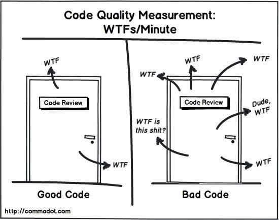

> 前段时间，公司前端群里讨论了一个问题：
> 如果一个 for 循环里，循环的次数 n 是一个常量那么时间复杂度是多少？ O(n) Or O(1)
> 这边文章我们会来研究下什么是时间复杂度，空间复杂度，然后来回答这个问题。

首先在讨论时间复杂度之前，我们来看下什么算是好的代码。



一段好的代码无非有**清晰的代码结构**、**快速的执行速度**、**自我解释的能力**……
我们的时间复杂度分析就可以从源头解决第二条的问题（当然不单单是这一点，但是我们就只说这一点 😂）

## 大 O 复杂度

算法的执行效率，简单来讲就是，代码执行的时间。但是怎么在不运行代码的情况下，粗率的估算代码的执行时间呢？

```javascript
const calc = n => {
  let sum = 0

  for (let i = 0; i < n; i++) {
    sum += i
  }
  return sum
}
```

上面的代码，执行的时间是怎么样呢？我们来假设每一行为一个执行单元并且执行时间都是相同的，为 unit_time。那么这段的执行时间是什么呢？
我们可以看到第二行执行了一次，第三行和第四行都执行了 n 次。那么执行时间就是 *(2n + 1) \* (unit_time)*。

按照这个思路，我们来分析下下面这段代码

```javascript
 const cal = n => {
   let sum = 0;
   let i = 1;
   let j = 1;
   for (; i <= n; ++i) {
     j = 1;
     for (; j <= n; ++j) {
       sum = sum +  i * j;
     }
   }
 }
```

第 2，3，4行都运行一次，第5，6行都运行 n 次，第7，8行都运行 n^2 次，所以我们整段代码我们需要运行的时间为 *T(n) = (2n + 2n^2 + 3)\*unit_time*。那么得到一个重要的结论 **所有代码的执行时间 T(n) 与每行代码的执行时间成正比**。我们可以总结成一个公式：

> T(n) = O( f(n) )

我们来解析一下这个公式：T(n) 表示代码执行的时间; n 表示数据规模的大小；f(n) 表示每行代码执行的次数总和。O 表示代码的执行时间 T(n) 与 f(n) 表达式成正比。

所以 T(n) = O(2n + 1) T(n) = (2n + 2n^2 + 3)。这些都是**大 O 时间复杂度表示法**。大 O 时间复杂度实际上并不具体表示代码真正的执行时间，而是表示**代码执行时间随数据规模增长的变化趋势**，所以，也叫**渐进时间复杂度**(asymptotic time)，简称 **时间复杂度**。

当 n 很大的时候，公式中的低阶、常量、系数这三部分并不左右增长趋势，所以都可以忽略。那么上面的两个复杂度可以记为： T(n) = O(n) T(n) = (n^2)。

