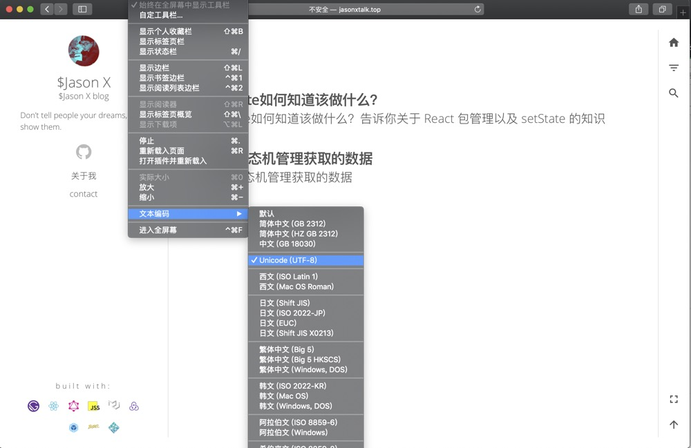
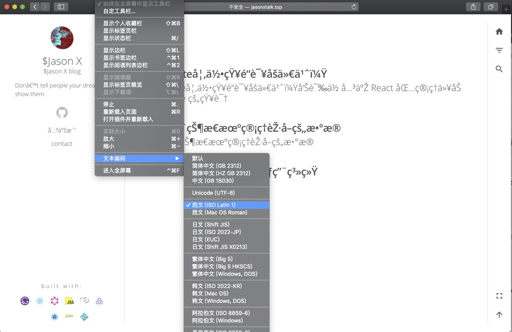

# ASCII Unicode UTF-8

在做课堂中优化中有一项是为 websocket 中传输的数据做压缩处理，缩小带宽的使用，在网上找到一个 zip 压缩，然后就突然想弄清楚编码这块的东西，于是就开始去搜索 🏄‍。诶，在写 Huffman 算法前，先记录一篇编码的文章。那么来吧。

## ASCII 码
在计算机中，所有的数据在存储和计算的时候都需要用二进制来表示，每一个二进制位（bit）有两种表现形式 `0` 和 `1`。一个字节（byte）用 8 个二进制位来表示，那么 8 个二进制可以组合出来 256 种状态。也就说一个字节可以表示 256 个字符，`00000000` ~ `11111111`。
ASCII 第一次以规范标准的类型发表是在1967年，最后一次更新则是在 1986 年，到目前为止共定义了 128 个字符。这 128 个字符只占用了一个字节后面的 7 位，最前面的一位统一为 `0`

### ASCII 问题
问题来了：英语用128个符号编码就够了，但是用来表示其他语言，128 个符号是不够的。比如，在法语中，字母上方有注音符号，它就无法用 ASCII 码表示。于是，一些欧洲国家就决定，利用字节中闲置的最高位编入新的符号。比如，法语中的 `é` 的编码为130（二进制 10000010 ）。这样一来，这些欧洲国家使用的编码体系，可以表示最多 256 个符号。

但是，这里又出现了新的问题。不同的国家有不同的字母，因此，哪怕它们都使用256个符号的编码方式，代表的字母却不一样。比如，130在法语编码中代表了é，在希伯来语编码中却代表了字母 Gimel (ג)，在俄语编码中又会代表另一个符号。但是不管怎样，所有这些编码方式中，0--127 表示的符号是一样的，不一样的只是 128--255 的这一段。

至于亚洲国家的文字，使用的符号就更多了，汉字就多达 10万 左右。一个字节只能表示 256 种符号，肯定是不够的，就必须使用多个字节表达一个符号。比如，简体中文常见的编码方式是 GB2312，使用两个字节表示一个汉字，所以理论上最多可以表示 256 x 256 = 65536 个符号。

中文目前的文字编码标准主要有 ASCII、GB2312、GBK、Unicode等。ASCII 编码是最简单的西文编码方案。GB2312、GBK、GB18030 是汉字字符编码方案的国家标准。这些不在本文的讨论范围。

## Unicode

正如上面说的编码方式有很多种，同一个二进制的数字在不同的编码方式下可以被解释成不同的符号。因此要打开一个文件的时候要知道它的编码方式，否则用错误的解码方式就会出现乱码。比如，你在任何一个网站上选择用不同的编码方式，你看到的内容就有可能是不一样的。

那么如果有一种编码方式可以将世界上的所有符号都纳入其中，那么是不是乱码就消失了。Unicode 就是为了解决传统的字符编码方案的局限而产生的，它为每种语言中的每个字符设定了统一并且唯一的二进制编码，以满足跨语言、跨平台进行文本转换、处理的要求。1990 年开始研发，1994 年正式公布。

在表示一个 Unicode 的字符时，通常会用 ”U+“ 然后紧接着一组十六进制的数字来表示这一个字符。比如，`U+0639` 表示阿拉伯字母 `Ain`。
**它是 0 开始，为每个符号指定一个编号，叫做 ”码点“ 。**

### Unicode 编号规则

目前 Unicode 一共收入了 109449 个符号，容纳世界上所有文字和符号，从 `0x0000`~`0x10FFFF`。 这么多的符号，Unicode 不是一次性定义的，而是分区定义的。每个区可以存放 65536 个（2^16）码点。目前一个有 17 个平面。

最前面的 2^16 个字符位，称为基本平面（Basic Multilingual Plane），它的码点范围是从 0 一直到 2^16-1，十六进制范围就是 `U+0000` ~ `U+FFFF`。所有最常见的字符都放在这个平面。

剩下的字符都放在辅助平面（SMP），它的码点范围是从 `U+010000` ~ `U+10FFFF`

### Unicode 的问题
注意， Unicode 只是一个符号集，它只规定了符号的二进制代码，却没有规定这个二进制代码应该如何存储。

比如，汉字严的 Unicode 是十六进制数4E25，转换成二进制数足足有15位（100111000100101），也就是说，这个符号的表示至少需要 2 个字节。表示其他更大的符号，可能需要3个字节或者4个字节，甚至更多。

这里就有两个严重的问题，第一个问题是，如何才能区别 Unicode 和 ASCII ？计算机怎么知道三个字节表示一个符号，而不是分别表示三个符号呢？第二个问题是，我们已经知道，英文字母只用一个字节表示就够了，如果 Unicode 统一规定，每个符号用三个或四个字节表示，那么每个英文字母前都必然有二到三个字节是0，这对于存储来说是极大的浪费，文本文件的大小会因此大出二三倍，这是无法接受的。

## UTF-8
UTF是 “Unicode Transformation Format” 的缩写，可以翻译成 Unicode 字符集转换格式，即怎样将 Unicode 定义的数字转换成程序数据。

互联网的普及，强烈要求出现一种统一的编码方式。UTF-8 就是互联网上使用最广的一种 Unicode 的实现方式。其他实现方式还包括 UTF-16（字符用两个字节或四个字节表示）和 UTF-32（字符用四个字节表示），不过在互联网上基本不用。**重复一遍，这里的关系是，UTF-8 是 Unicode 的实现方式之一。**

UTF-8 的特点是对不同范围的字符使用不同长度的编码。它用 1~4 个字节表示一个符号，根据不同的符号而变化字节长度。

**UTF-8 的编码规则很简单，只有二条：**

1. 对于单字节的符号，字节的第一位设为 0，后面7位为这个符号的 Unicode 码。因此对于英语字母，UTF-8 编码和 ASCII 码是相同的。

2. 对于n字节的符号（n > 1），第一个字节的前n位都设为1，第n + 1位设为0，后面字节的前两位一律设为 10。剩下的没有提及的二进制位，全部为这个符号的 Unicode 码。

下表总结了编码规则，字母 `x` 表示可用编码的位。

Unicode符号范围 | UTF-8编码方式
---|---
0000 0000-0000 007F | 0xxxxxxx
0000 0080-0000 07FF | 110xxxxx 10xxxxxx
0000 0800-0000 FFFF | 1110xxxx 10xxxxxx 10xxxxxx
0001 0000-0010 FFFF | 11110xxx 10xxxxxx 10xxxxxx 10xxxxxx

根据上表，解读 UTF-8 编码非常简单。如果一个字节的第一位是 0，则这个字节单独就是一个字符；如果第一位是 1，则连续有多少个 1，就表示当前字符占用多少个字节。

`汉` 字的 Unicode 编码是 `0x6C49`( `0110 1100 0100 1001` )， 根据上表，可以发现 `0x6C49` 位于 第三行的范围内 `0x0800` ~ `0xFFFF`，因此 `汉` 的 UTF-8 编码需要是三个字节，即格式是 `1110xxxx 10xxxxxx 10xxxxxx`。然后从 `汉` 的最后一个二进制开始，依次从后向前填入格式中的 `x`，多出的位补 `0` 。这样就得到了 `汉` 的 UTF-8 编码是 `11100110 10110001 10001001`，即 `E6B189`。

下一篇，我会继续写下 JavaScript 中的编码。