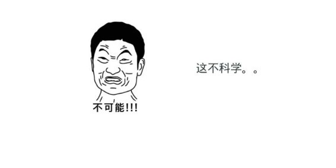
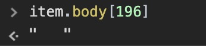

> 产品经理： 老司机；苦逼程序员：我
> 老司机：Jason，来看下怎么这个笔记在 APP 端有展示，在 PC，Mobile 端没有展示笔迹；
> 我：卧槽，不可能啊，都是一样的处理啊；
> 老司机： 那你看看，顺便打开了 APP 和 PC 端的展示效果；
> 我：卧槽，还真是（问号中）；
> 于是我低着头思考着问题回到了工位，心里思考着，不可能啊，我走修复过这个上课前添加笔迹的 bug 了，怎么还会有呢？上一张图表示我当时的状态。



接下来就开始调试代码，通过测试发现一些笔迹被过滤掉了，来看这段代码

```javascript
try {
      item.body = JSON.parse(item.body);
    } catch (e) {
      continue;
    }
```
这段代码会在 `JSON.parse()` 出错的时候跳过一次循环，那么我们来打个断点看看被过滤掉的笔迹为什么不能被 `parse`。
我们看到 `catch` 的消息
```javascript
SyntaxError: Unexpected token 	 in JSON at position 196
    at JSON.parse (<anonymous>)
    at ignoreNoise (eventlog.js:53)
    at eventlog.js:391 "error"
```
OK，这种报错一看就是不符合 `json` 字符串的格式导致的，那么我们来看 `196` 的位置是什么。



我们看到像是一连串的空格，那到底是什么呢？
```javascript
encodeURI(item.body[196])
"%09"
```
OK，我们查到 `%09` 是 `TAB` 。那么问题找到了，我们只需要把 `TAB` 产生的输入替换到就行了。那么需要怎么做呢？

```javascript
  const decodeBoby = decodeURI(encodeURI(item.body).replace(/%0A/g, '\\n').replace(/%09/g, '\\t').replace(/%0D/g, '\\r'));
```

在上面的一行代码中我们看到 `%0A` `%0D` 也被转换了，那么这个到底是什么需要被转换呢？

在这本 [JSON standard](http://www.ecma-international.org/publications/files/ECMA-ST/ECMA-404.pdf) 的文档里我们可以看到下面写的。

>A JSON text is a sequence of tokens formed from Unicode code points that conforms to the JSON value
grammar. The set of tokens includes six structural tokens, strings, numbers, and three literal name tokens.
The six structural tokens:
[ U+005B left square bracket
{ U+007B left curly bracket
] U+005D right square bracket
} U+007D right curly bracket
: U+003A colon
, U+002C comma
These are the three literal name tokens:
true U+0074 U+0072 U+0075 U+0065
false U+0066 U+0061 U+006C U+0073 U+0065
null U+006E U+0075 U+006C U+006C

>Insignificant whitespace is allowed before or after any token. Whitespace is any sequence of one or more of
the following code points: character tabulation (U+0009), line feed (U+000A), carriage return (U+000D), and
space (U+0020). Whitespace is not allowed within any token, except that space is allowed in strings.

重点看 `Insignificant whitespace` 这行，意思是什么呢，`Whitespace` 是不允许出现在 任何的 token 中的，但是 `space (U+0020)` 是允许出现在字符串中的。`Whitespace` 主要包含那些呢，上面写道 `character tabulation (U+0009) (tab)`, `line feed (U+000A) (换行符)`, `carriage return (U+000D) (回车)`。

那么原因就是在这里。ENJOY。

